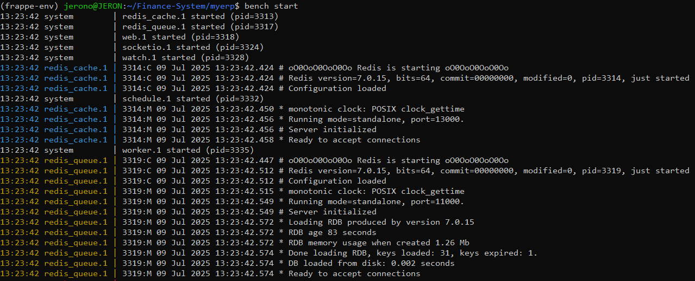
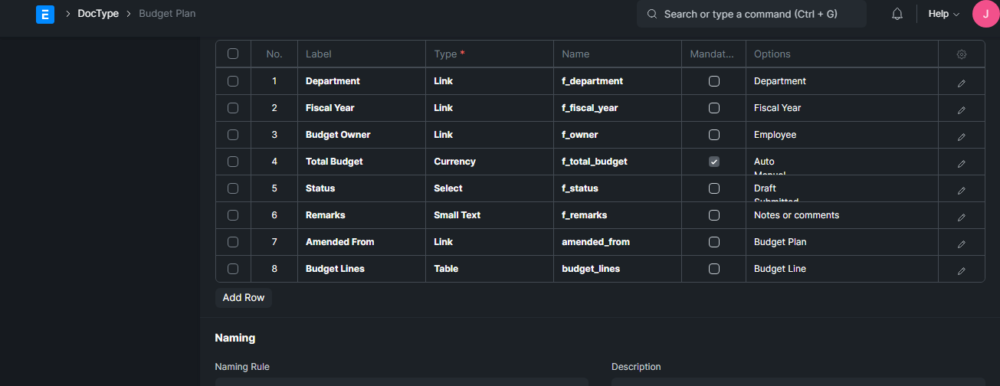
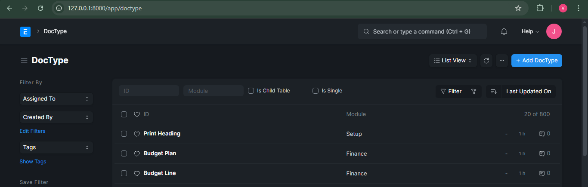

# Finance App

A modular and scalable finance system built from scratch using the **Frappe Framework** and **ERPNext**.  
This app is designed to streamline and digitize **core financial operations** for businesses, institutions, or public sector agencies.

---

## Features Implemented

- **Custom Frappe App:** `finance_app` created and structured following Frappe best practices.
- **Custom DocType:**  
  - `Budget Plan`: Designed to manage financial planning.
  - Includes fields linked to existing DocTypes such as:
    - `Department`
    - `Fiscal Year`
    - `Account`
    - `Employee`
    - `User`
- **Exported Fixtures:**
  - All fields and DocType definitions exported for versioning and deployment via Git.
- **Hooks Configuration:**
  - Fixtures auto-loaded with the app for consistent installs.

---

## How to Test

> Requirements: Frappe v14, ERPNext v14, Redis, Python 3.10+, Node.js 16+

1. Clone the repo  
   ```bash
   git clone https://github.com/VAL-Jerono/Finance-System.git
   cd Finance-System/myerp
````

2. Create and activate your environment

   ```bash
   python3 -m venv frappe-env
   source frappe-env/bin/activate
   ```

3. Install dependencies & start bench

   ```bash
   bench start
   ```

### Preview




4. Access the site

   * Navigate to: `http://localhost:8000`
   * Go to: `Finance App` > `Budget Plan`

### Preview



### Preview



---

## 📁 Folder Structure

```
finance_app/
├── finance_app/         # App module
│   ├── fixtures/        # Exported DocType and field definitions
│   ├── config/
│   ├── public/
│   └── images/
│   ├── templates/
│   ├── __init__.py
│   ├── hooks.py
│   └── modules.txt
├── license.txt
├── pyproject.toml
└── README.md            # This file
```

---

## 🔖 License

[MIT](./license.txt)

---

## Author

**VAL-Jerono**
GitHub: [VAL-Jerono](https://github.com/VAL-Jerono)

```
